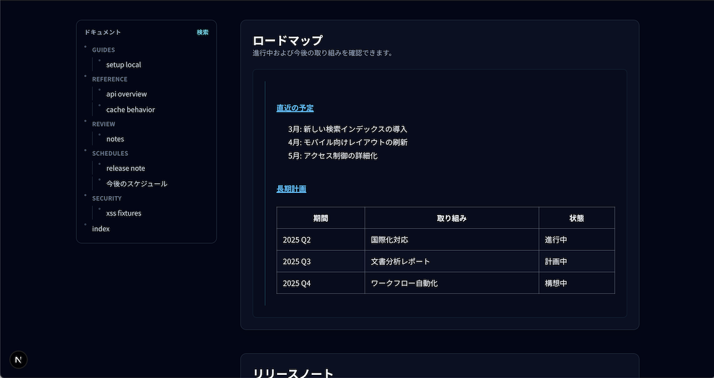
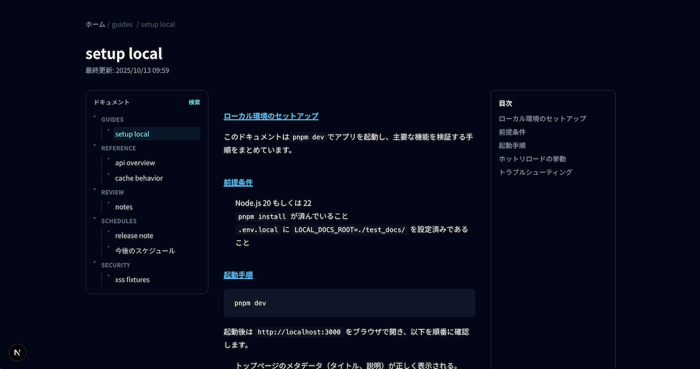
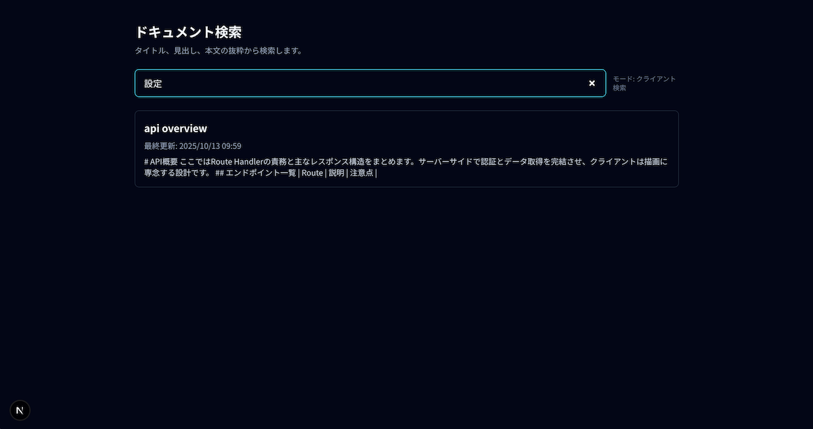

# ドキュメントビューワ
このアプリはドキュメントビューワです。

## セットアップ
1. 依存関係をインストールします。
```bash
pnpm install
```

2. 必要な環境変数を設定してください（例: `.env.local`）。
| 変数名 | 説明 |
| --- | --- |
| `RUN_MODE` | `local` または `cloud` |
| `ALLOWED_DOMAIN` | 許可ドメイン (`example.co.jp` 等) |
| `FIREBASE_PROJECT_ID` | Firebase プロジェクト ID |
| `FIREBASE_WEB_API_KEY` | クライアント用 API キー |
| `FIREBASE_AUTH_EMULATOR_HOST` | Local モード時の認証エミュレータ (`localhost:9099` 等) |
| `LOCAL_DOCS_ROOT` | Local モードのドキュメントディレクトリ |
| `GCP_PROJECT_ID`, `GCS_BUCKET` | Cloud モードで使用 |


## ビルド
```bash
pnpm build
pnpm start
```

## 開発サーバー起動
```bash
pnpm dev
```
ローカルのエミュレータ実行方法は`README_FirebaseEmulator.md`を参照のこと。

## テスト
単体テストおよびスナップショットテストを実行します。

```bash
# ユニットテスト
pnpm test

# lint
pnpm lint

# 型チェック
pnpm exec tsc --noEmit
```

## 画面イメージ



